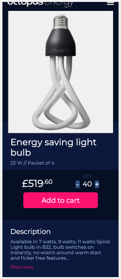
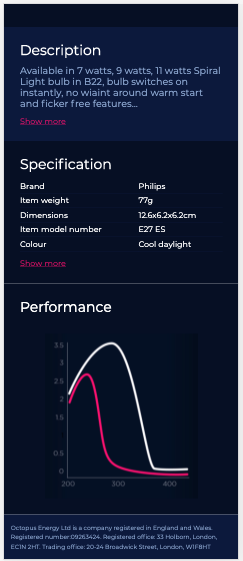

# OE Test

## Technical challenge - Front-end Developer

### Requirements

- Clean, semantic code
- Front-end that mirrors the design
- Mobile-first development
- An example of async service, for FE app to interact with

## Installation

- `git clone ****` project locally
- `cd oe-test` change into folder
- `npm i` to install all dependencies
- `npm run start` to start in parallel Express and Front End app
- visit `localhost:3000` for see app, `localhost:8080` to see endpoint with JSON data
- `npm run cy-start` to see Cypress tests for counter (counter_test.js)

## Technology used

- React, Redux
- hooks, High Order Components (HOC)
- axios npm (data fetching)
- Express server (serving JSON data)
- Sass for styling
- Parcel for bundling
- Mobile first, media queries
- Cypress (e2e testing)
- Chart in Recharts.js (data from JSON)

## Comments (to be completed)

- Jest tests (snapshot and more?)

## Screenshots

